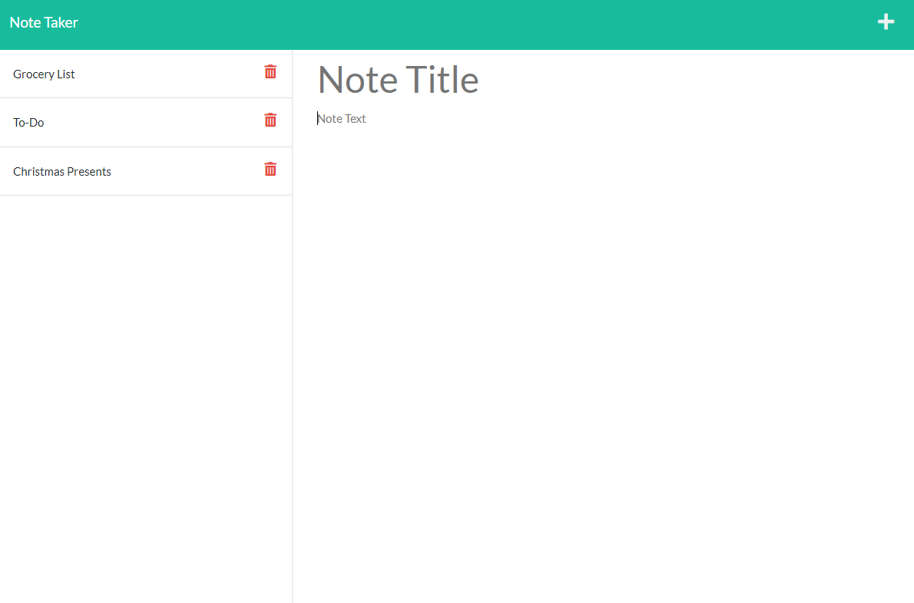

# Note-Taker

## Description

My task was to built an app where the user can add note with the corresponding title. The user begins by running node.js to run the local server in order to access the note taker webpage. When the user opens the webpage, they are presented with the landing to page where the user can click the "Get Started" button to go to the next page to write their notes. The user can add notes and delete their notes whenever the user wants.

## Installation

User must have Node.js installed, as well as Inquirer 8.2.4 and Express

## User Story

AS A small business owner
I WANT to be able to write and save notes
SO THAT I can organize my thoughts and keep track of tasks I need to complete

## Acceptance Criteria

GIVEN a note-taking application
WHEN I open the Note Taker
THEN I am presented with a landing page with a link to a notes page
WHEN I click on the link to the notes page
THEN I am presented with a page with existing notes listed in the left-hand column, plus empty fields to enter a new note title and the note’s text in the right-hand column
WHEN I enter a new note title and the note’s text
THEN a Save icon appears in the navigation at the top of the page
WHEN I click on the Save icon
THEN the new note I have entered is saved and appears in the left-hand column with the other existing notes
WHEN I click on an existing note in the list in the left-hand column
THEN that note appears in the right-hand column
WHEN I click on the Write icon in the navigation at the top of the page
THEN I am presented with empty fields to enter a new note title and the note’s text in the right-hand column

## Review

my repo page

- https://github.com/92castro/Note-Taker

